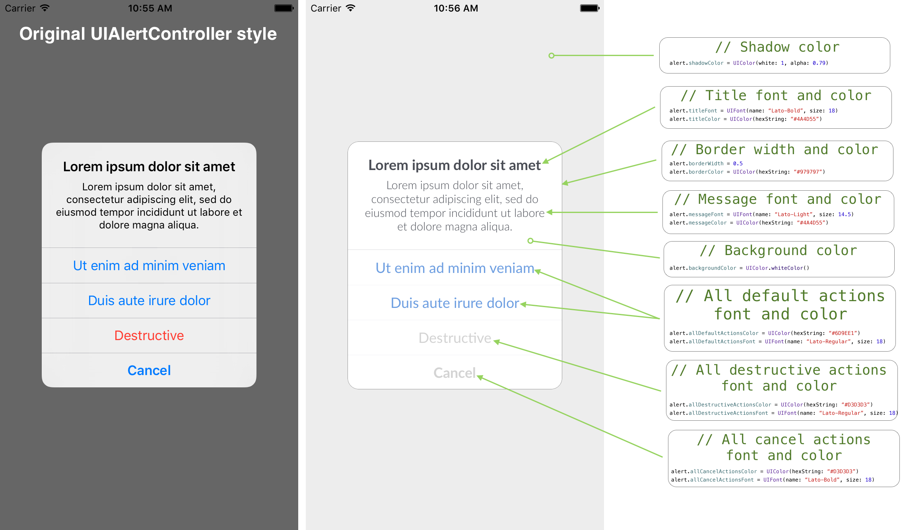

# OKAlertController

[](http://cocoapods.org/pods/OKAlertController)
[](http://cocoapods.org/pods/OKAlertController)
[](http://cocoapods.org/pods/OKAlertController)
[](https://travis-ci.org/OlehKulykov/OKAlertController)
[](http://olehkulykov.github.io/OKAlertController)



### Usage

#### Create, customize and show/present
```swift
// Create alert controller as usual
let alert = OKAlertController(title: "Some title", message: "Some message")

// Fill with reqired actions
alert.addAction("Do you want to to something?", style: .Default) { _ in
  // Process action
}

alert.addAction("Cancel", style: .Cancel, handler: nil) // Ignore cancel action handler

// Setup alert controller to conform design
alert.titleFont = ... /// <- Title text font
alert.titleColor = ... /// <- Title text color
... /// <- Any other customisation

alert.show(fromController: self, animated: true)
```

**It's recommended to create extension of the alert controller, once setup style to conform the design and reuse in any part of your project.**

See below example:
```swift
extension OKAlertController {
  // For instance your style called "Minimalistic", just create function to show this style of alert
  func showMinimalistic() {
    // Get root UIViewController, or you could use any other
    guard let rootController = UIApplication.sharedApplication().delegate?.window??.rootViewController else {
      return
    }

    // Setup style before show
    self.shadowColor = UIColor(white: 1, alpha: 0.79)
    self.backgroundColor = UIColor.whiteColor()
    ... /// <- Any other customisation

    // Finaly show alert controller
    show(fromController: rootController, animated: true)
  }
}


// Somewhere in the code
let alert = OKAlertController(title: "Some title", message: "Some message")
... /// <- Fill with actions
// Show "Minimalistic" style provided by bellow extension
alert.showMinimalistic()

```


### Requirements
- Minimum iOS: 8.0
- Works for both iPhone and iPad

### Installation

- OKAlertController is available through [CocoaPods](http://cocoapods.org). To install it, simply add the following line to your Podfile:
```ruby
pod "OKAlertController"
```
- Manual copy contents of the directory ```OKAlertController/Controller/OKAlertController/``` to your project and use.

### License
----------

The MIT License (MIT)

Copyright (c) 2016 Oleh Kulykov <info@resident.name>

Permission is hereby granted, free of charge, to any person obtaining a copy
of this software and associated documentation files (the "Software"), to deal
in the Software without restriction, including without limitation the rights
to use, copy, modify, merge, publish, distribute, sublicense, and/or sell
copies of the Software, and to permit persons to whom the Software is
furnished to do so, subject to the following conditions:

The above copyright notice and this permission notice shall be included in
all copies or substantial portions of the Software.

THE SOFTWARE IS PROVIDED "AS IS", WITHOUT WARRANTY OF ANY KIND, EXPRESS OR
IMPLIED, INCLUDING BUT NOT LIMITED TO THE WARRANTIES OF MERCHANTABILITY,
FITNESS FOR A PARTICULAR PURPOSE AND NONINFRINGEMENT. IN NO EVENT SHALL THE
AUTHORS OR COPYRIGHT HOLDERS BE LIABLE FOR ANY CLAIM, DAMAGES OR OTHER
LIABILITY, WHETHER IN AN ACTION OF CONTRACT, TORT OR OTHERWISE, ARISING FROM,
OUT OF OR IN CONNECTION WITH THE SOFTWARE OR THE USE OR OTHER DEALINGS IN
THE SOFTWARE.
